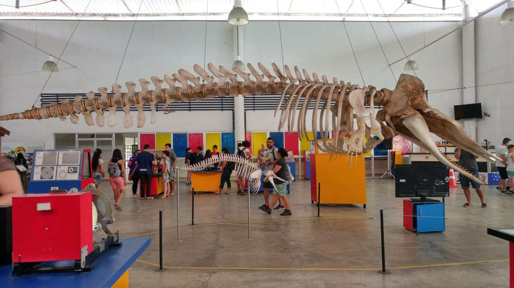
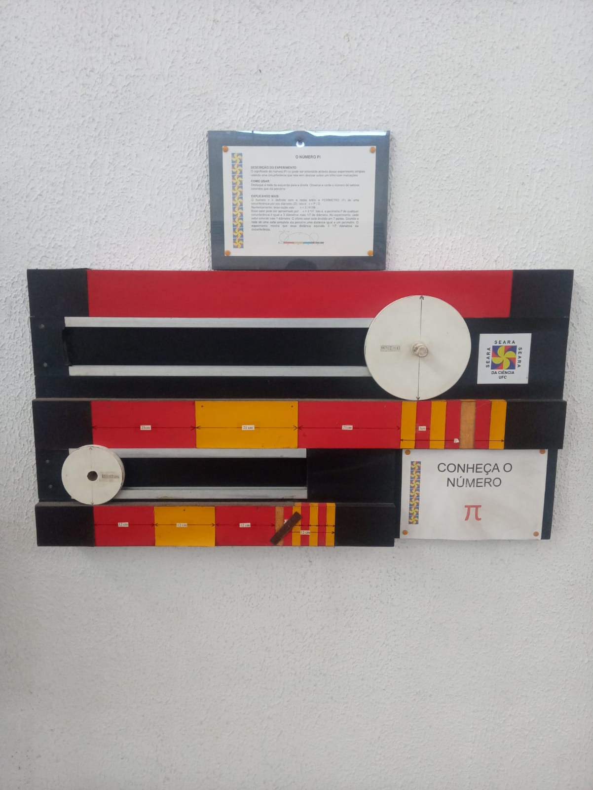

# Conheça o Número Pi

Bem-vindo ao projeto "Conheça o Pi"! Ele foi desenvolvido durante o ano de 2021 na Seara. 👨‍💻️

O que é a Seara? 🤔️

- A Seara da Ciência, órgão de divulgação científica da Universidade Federal do Ceará, busca popularizar a ciência para alunos, professores e visitantes em geral e tem como vertente um museu lotado de experimentos com projetos tecnológicos que buscam despertar o interesse deste público, tendo como lema “é proibido não mexer”. 

- Com o surgimento da pandemia de Covid-19 no ano de 2020, evitar o contato direto com objetos compartilhados, se tornou uma das principais medidas adotadas para combater a propagação do vírus causador da doença. Tendo em vista esse contexto e a necessidade de renovação do experimento que apresenta o cálculo do número pi no salão, foi criado o projeto “Conheça o Pi”, que busca causar uma admiração pela história deste número, através da interação com uma interface gráfica que calcula junto com o usuário o valor do número pi, da mesma forma que Arquimedes calculou, por volta de 240 a.c. 

🧐️ Experimento antigo:

🤯️ Novo experimento:

🤖️ Ele une algoritmos de interface gráfica e de visão computacional, área do aprendizado de máquina que possibilita implementar o reconhecimento de imagens. Através das bibliotecas PyQt5 e OpenCV na linguagem Python, foi estruturado o reconhecimento de gestos com a mão, permitindo a interação a distância através de uma câmera, evitando o contato e compartilhamento de teclado e mouse entre os visitantes. 

O principal componente responsável pela implementação destas tecnologias, foi o Raspberry Pi 4, um microcomputador do tamanho de um cartão de crédito, que viabiliza a criação de projetos com interface gráfica e conexão com periféricos como: teclado, mouse e câmera. O projeto "Conheça o Pi" permite uma imersão na história deste número, com o máximo de interatividade e o menor contato físico possível dos visitantes. Venha conhece!

Seara da Ciência - UFC - Rua Dr. Abdenago Rocha Lima, s/n - Pici, Fortaleza - CE, 60455-320
